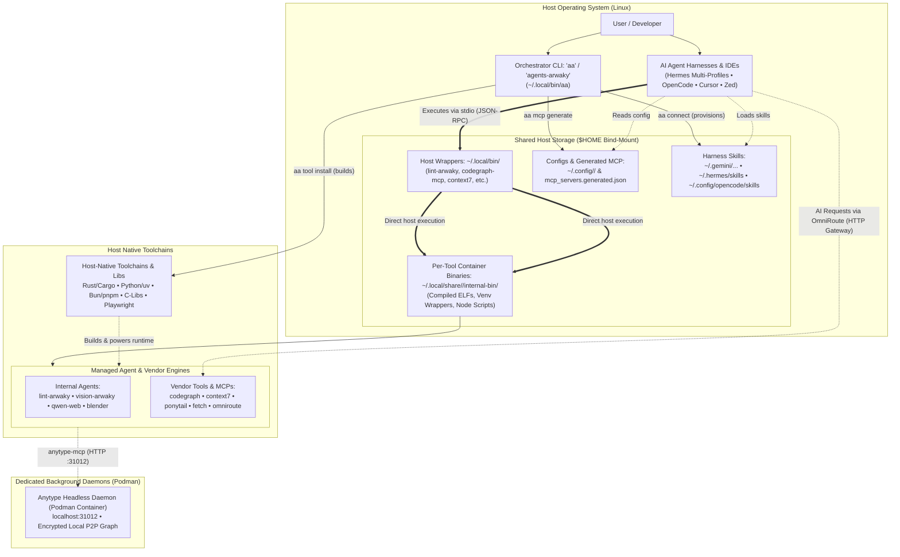

# agents-arwaky


---


Modern autonomous AI workflows demand dozens of polyglot toolchains—Rust (`cargo`), Node (`pnpm`/`npm`), Bun, Python (`uv`), Playwright headless browsers, and system C-libraries. Installing these natively clutters the host operating system, introduces version conflicts, and creates security vulnerabilities.

**`agents-arwaky`** solves this through a **Local Bare-Metal Architecture**:

- ⚡ **Direct Host Execution:** Compilers, dependencies, and runtimes are installed natively on the host. Tools compile to host-native binaries in `~/.local/bin/` via standard Linux XDG integration. Run tools from your host terminal directly.
- 🤖 **Universal MCP Hub & Skills Provisioner:** Out-of-the-box integration for AI harnesses (Hermes Agent with multi-profile MCP/env sync and default-profile-only skill provisioning, OpenCode, Cursor, Zed) via declarative MCP configs and automated skill provisioning.
- 🎯 **Unified Orchestration (`agents-arwaky` / `aa` CLI):** One single control point for diagnostics, health checks, execution dispatching, and build pipelines.
- 🐳 **Containerized Daemons:** Anytype runs in a Podman container. OmniRoute runs host-native (no container, no Docker). CLI tools and MCPs are host-native.

---

## Prerequisites

- Python 3.10+, Node.js 18+, Rust toolchain, uv, pnpm
- See `aa doctor` to verify host prerequisites.

## Architecture

### System Flow



### Directory Layout

```text
agents-arwaky/
├── install.sh                   # CLI launcher installer → ~/.local/bin/{agents-arwaky,aa}
├── mcp_servers.generated.json   # Auto-generated unified MCP client manifest (gitignored)
├── AGENTS.md                    # Operational manual & architecture context for AI agents
├── CONTRIBUTING.md              # Contributor workflows (adding/removing vendor tools)
├── CHANGELOG.md                 # Notable changes per release
├── THIRD_PARTY_LICENSES.md      # Upstream licensing compliance records
├── LICENSE                      # Project License (MIT)
│
├── tests/                       # Unit tests (envfile, xdg, manifest, …)
│
├── internal/                    # In-House Autonomous Agents & Tools (Git submodules)
│   ├── blender-arwaky/          # Headless 3D pipeline & rendering execution engine
│   ├── lint-arwaky/             # Rust-based Architecture Enforcement System (AES)
│   ├── qwen-web-arwaky/         # Playwright-driven browser automation & MCP
│   └── vision-arwaky/           # Computer vision MCP (VLM, OCR, visual memory)
│
├── vendor/                      # Pinned Upstream Repositories (Git Submodules)
│   ├── omniroute/               # Free-first AI gateway (host-native, port 7777)
│   ├── anytype-mcp/             # Anytype desktop & sync integration
│   ├── codegraph/               # Codebase intelligence & graph query engine
│   ├── context7/                # Upstash documentation & context retrieval
│   ├── fetch-mcp/               # Fast, clean web scraping & text extraction
│   ├── google-workspace-mcp/    # Google Workspace integration (Gmail, Drive, Docs, etc.)
│   ├── hindsight/               # Hindsight agent memory: LLM extraction, knowledge graph & retrieval
│   └── ponytail/                # Agent architecture patterns & instructions
│
├── modules/                     # AES 7-layer orchestration (taxonomy→…→root)
│   ├── shared/src/<domain>/     # Shared domains: xdg, manifest, config, tool, skill, harness, …
│   ├── installer/  updater/  uninstaller/  runner/    # Tool install/update/uninstall/run (data-driven)
│   ├── daemon/  service/  mcp/  skill/  harness/  backup/  check/  doctor/
│   └── cli/                     # Composition root wiring all feature modules
│
└── tools/                       # Orchestration entrypoint & static config (Python)
    ├── cli/                     # Unified CLI launcher (arwaky.py)
    ├── config/                  # SSOT manifest.json, version.txt, daemon env templates
    ├── deploy/                  # Podman/systemd deployment units (Containerfile, .service)
    └── tests/                   # Quality-gate test suite (108 tests)
```

---

## Quick Start

### 1. Clone with Submodules

```bash
git clone --recurse-submodules https://github.com/rakaarwaky/agents-arwaky.git
cd agents-arwaky
```

### 2. Install the CLI

Install the `agents-arwaky` launcher (alias `aa`) into `~/.local/bin` so it
can be invoked from any terminal:

```bash
./install.sh
```

> [!TIP]
> If you previously cloned without submodules, initialize them via:
>
> ```bash
> aa submodules
> ```

### 3. Verify Host Prerequisites

Ensure [Podman](https://podman.io/) (or Docker) is installed for the optional Anytype daemon:

OmniRoute is host-native — no container and no Docker required. Install it with `npm install -g omniroute`:

```bash
aa doctor
```

*(Runs an all-in-one diagnostics pass and reports missing host prerequisites.)*

Required core tools: `git`, `jq`, `curl`, `python3`. Recommended: `cargo` (Rust), `uv` (Python), `node`/`npm`/`pnpm`/`bun` (Node).

### 4. Build & Provision (One-Command)

```bash
aa install
```

This single command executes the end-to-end setup pipeline:

1. Initializes git submodules (`vendor/`, `internal/`).
2. Compiles all internal agents and vendor tools natively on host into XDG prefixes.
3. Installs binary launchers to host `~/.local/bin/`.
4. Generates unified MCP configurations at `mcp_servers.generated.json`.

### 5. Verify System Health

```bash
aa doctor
aa status
```

---

### Unified Orchestrator CLI (`agents-arwaky` / `aa`)

The repository installs the `agents-arwaky` CLI and its short alias `aa` into `~/.local/bin/`. It serves as the single pane of glass for monitoring, executing, and managing all ecosystem components.

```
   ___                           _        
  / _ | _______    _____ _ / /____ __   
 / __ |/ __/ _ \/\/ _ `/  '_/ // /   
/_/ |_/_/  \_/\_/\_,_/_/\_\_, /  
                           /___/   
 agents-arwaky Unified Tool Orchestrator v1.0
```

### Command Reference

| Command                                  | Purpose                                                                                            | Example                                        |
| ------------------------------------------ | ---------------------------------------------------------------------------------------------------- | ------------------------------------------------ |
| `aa status`                              | Display health, installation state, and submodule readiness                                        | `aa status`                                    |
| `aa doctor`                              | All-in-one ecosystem diagnostics (toolchains, daemons, MCP config, harnesses)                    | `aa doctor`                                    |
| `aa tool <cmd> [args]`                   | Tool management: `list`, `run`, `install`, `update`, `uninstall`                                    | `aa tool install lint-arwaky`                   |
| `aa skill <cmd> [args]`                  | Skill management: `list`, `install`, `uninstall`, `update`, `show`, `check`                          | `aa skill install --all` · `aa skill update`  |
| `aa connect [targets]`                   | Bridge MCP & skills into agent harnesses — harness `skills/` becomes a symlink to the pack (manage once in `skills/`); `--copy-skills` snapshots instead (`--hermes`, `--opencode`, `--grok-build`, `--all`) | `aa connect --all`                             |
| `aa disconnect [targets]`                | Disconnect harnesses (use `--all` to disconnect all)                                                | `aa disconnect --all`                          |
| `aa mcp list`                            | Enumerate all tools offering Model Context Protocol servers                                        | `aa mcp list`                                  |
| `aa mcp show`                            | Inspect current generated unified MCP client manifest                                              | `aa mcp show`                                  |
| `aa mcp generate`                        | Rebuild unified client configuration (`mcp_servers.generated.json`)                                | `aa mcp generate`                              |
| `aa service [action] [target]`           | Unified manager for background services (`status`, `start`, `stop`, `restart`, `logs`)              | `aa service status`                            |
| `aa submodules`                          | Cleanly initialize or update all git submodules                                                    | `aa submodules`                                |
| `aa clean`                              | Remove build artifacts & generated MCP config                                                     | `aa clean`                                     |
| `aa reset`                            | Full factory reset: clean + uninstall + disconnect + unskill                                       | `aa reset`                                     |
| `aa backup <tool\|all> <target>`       | Back up tool state locally or to Google Drive                                                     | `aa backup all gdrive`                         |
| `aa restore <tool\|all> <source>`      | Restore tool state from a backup                                                                  | `aa restore all gdrive`                        |
| `aa anytype <action>`                    | Manage headless Anytype daemon (`start`, `stop`, `status`, `auth-key`, `space-join`, `space-list`) | `aa anytype status`                            |
| `aa omniroute <action>`                | Manage OmniRoute free AI gateway, daemon & models                                                 | `aa omniroute status`                         |

> [!TIP]
> Use `agents-arwaky` or the short alias `aa` interchangeably. Backward-compat shortcuts (`aa install`, `aa run`, …) still work.

### Practical Examples

```bash
# Codebase indexing with codegraph
aa tool run codegraph index .

# Architecture validation across the repository
aa tool run lint-arwaky --help

```

---

### Agent & Tool Catalog

> [!TIP]
> The single source of truth (SSOT) for all tool registrations is [`config/manifest.json`](config/manifest.json). You can also run `aa tool list` or `aa mcp list` to inspect live tool status from the terminal.

### Core In-House Agents (`internal/`)

Specialized autonomous agents developed specifically for the `agents-arwaky` ecosystem:

| Agent / Tool                                     | Binary & Aliases                                                                      | Language & Stack    |             MCP?             | Description                                                                                                                                                                                    |
| -------------------------------------------------- | --------------------------------------------------------------------------------------- | --------------------- | :-----------------------------: | ------------------------------------------------------------------------------------------------------------------------------------------------------------------------------------------------ |
| **[lint-arwaky](internal/lint-arwaky/)**         | `lint-arwaky` (`la`, `lac`, `lint-arwaky-cli`, `lint-arwaky-mcp`, `lint-arwaky-tui`)  | Rust                |  **Yes** (`lint-arwaky-mcp`)  | Architecture Enforcement System (AES) validating 24 rules across Rust, Python, TypeScript. Exposes 5 MCP tools:`execute_command`, `get_config`, `health_check`, `list_commands`, `read_skill`. |
| **[vision-arwaky](internal/vision-arwaky/)**     | `vision-arwaky` (`va`, `vision-arwaky-cli`, `vision-arwaky-mcp`, `vision-arwaky-tui`) | Python /`uv`        | **Yes** (`vision-arwaky-mcp`) | Unified vision intelligence: VLM inspection, OCR extraction, and visual memory.                                                                                                                |
| **[qwen-web-arwaky](internal/qwen-web-arwaky/)** | `qwen-web-arwaky` (`qwa`, `qwc`, `qwen-web-cli`, `qwen-web-mcp`)                      | Python / Playwright |   **Yes** (`qwen-web-mcp`)   | Browser automation engine with bi-directional MCP interface.                                                                                                                                   |
| **[blender-arwaky](internal/blender-arwaky/)**   | `blender-arwaky` (`ba`, `blender-mcp`)                                                | Python / Blender    |    **Yes** (`blender-mcp`)    | Headless 3D procedural execution, asset generation, and rendering pipeline.                                                                                                                    |
| **[anytype-daemon](modules/daemon/)**  | `aa anytype` (AES daemon module)   | Python / Podman     |              No              | Headless Anytype daemon managing local-first encrypted P2P space sync for `anytype-mcp`.                                                                                                        |
| **[skill](modules/skill/)**            | `aa skill` (AES skill module)      | Python              |              No              | Agent skill manager: list, provision, uninstall & sync skills across tools and workspaces; `update` pulls internal submodule skills into the pack.                                                |

### Curated Upstream Vendor Tools (`vendor/`)

High-performance community tools integrated via Git submodules and sandboxed with isolated XDG prefixes:

| Tool            | Exported Binary                    | Source Repo                                                           |      Protocol      | Focus Area                                                              |
| ----------------- | ------------------------------------ | ----------------------------------------------------------------------- | :------------------: | ------------------------------------------------------------------------- |
| **context7**    | `context7-mcp`, `ctx7`             | [upstash/context7](https://github.com/upstash/context7)               |  CLI / MCP Server  | Rapid documentation retrieval and vector context ingestion.             |
| **codegraph**   | `codegraph-mcp`, `codegraph`       | [colbymchenry/codegraph](https://github.com/colbymchenry/codegraph)   |     CLI / MCP     | Graph-based codebase intelligence and semantic symbol indexing.         |
| **fetch-mcp**   | `fetch-mcp`, `mcp-fetch`           | [zcaceres/fetch-mcp](https://github.com/zcaceres/fetch-mcp)           |     MCP Server     | Resilient web scraping, HTML cleaning, and Markdown transformation.     |
| **ponytail**    | `ponytail-mcp`                     | [DietrichGebert/ponytail](https://github.com/DietrichGebert/ponytail) |     MCP Server     | Senior-developer prompt instructions and agent behavioral patterns.     |
| **anytype-mcp** | `anytype-mcp`                      | [anyproto/anytype-mcp](https://github.com/anyproto/anytype-mcp)       |     MCP Server     | Local-first knowledge base & workspace synchronization.                 |
| **omniroute**   | `omniroute`                        | [diegosouzapw/OmniRoute](https://github.com/diegosouzapw/OmniRoute) | HTTP Gateway       | Free-first AI gateway: 350+ providers, 150+ free tiers, `auto/best-*` combos. Host-native, no Docker. State in `~/.omniroute/`. |
| **workspace**   | `workspace-mcp`                    | [taylorwilsdon/google_workspace_mcp](https://github.com/taylorwilsdon/google_workspace_mcp) | MCP Server | Google Workspace full integration (Gmail, Drive, Docs, Sheets, Chat).   |
| **hindsight**   | `hindsight`, `hindsight-local-mcp`   | [vectorize-io/hindsight](https://github.com/vectorize-io/hindsight) | MCP / Plugin | LLM-extracted agent memory: knowledge graph, observations, multi-strategy retrieval (semantic/keyword/graph/temporal). Local pg0 + OpenAI-compatible LLM. |

---

### MCP Client Integration

`agents-arwaky` generates a standardized, unified MCP client configuration file during `aa tool install` or `aa mcp generate`:

📁 File Location: `mcp_servers.generated.json`

```json
{
  "mcpServers": {
    "context7": { "command": "context7-mcp" },
    "fetch": { "command": "fetch-mcp" },
    "ponytail": { "command": "ponytail-mcp" },
    "anytype": {
      "command": "anytype-mcp",
      "env": {
        "ANYTYPE_API_BASE_URL": "http://127.0.0.1:31012",
        "OPENAPI_MCP_HEADERS": "{\"Authorization\":\"Bearer <YOUR_API_KEY>\", \"Anytype-Version\":\"2025-11-08\"}"
      }
    },
    "codegraph": {
      "command": "codegraph-mcp",
      "args": ["serve", "--mcp"]
    },
    "vision": { "command": "vision-arwaky-mcp" },
    "qwen-web": { "command": "qwen-web-mcp" },
    "blender": { "command": "blender-mcp" },
    "lint": { "command": "lint-arwaky-mcp" },
    "workspace": { "command": "workspace-mcp" },
    "hindsight": { "command": "hindsight-local-mcp" }
  }
}
```

### 🧠 Anytype Headless Daemon (Podman)

`agents-arwaky` includes a headless Anytype daemon powered by `anytype-cli` inside Podman so your AI agents have their own persistent local knowledge graph:

```bash
# 1. Start the headless daemon container
aa anytype start

# 2. Check daemon health and API status
aa anytype status

# 3. Generate API key (auto-updates .env and MCP config)
aa anytype auth-key "arwaky-agent-key"

# 4. Invite agent to your Anytype Space (from desktop app invite link)
aa anytype space-join "<your-invite-link>"

# 5. List joined spaces
aa anytype space-list
```

### 🔗 Automated Harness Connector (`aa connect`)

Instead of manually copying configurations, use `aa connect` to automatically inject all 11 MCP servers and provision 80+ skills into your agent harnesses:

```bash
# Connect to specific harness
aa connect --hermes           # Hermes Agent (MCP & env: all profiles · Skills: default profile only)
aa connect --opencode         # OpenCode (~/.config/opencode/opencode.jsonc & skills/)
aa connect --grok-build       # Grok Build (~/.grok/config.toml & skills/)

# Connect to all supported harnesses at once
aa connect --all

# Additional Flags:
aa connect --all --force      # Overwrite existing skill files and MCP entries
aa connect --all --dry-run    # Preview changes without modifying files
aa connect --all --mcp-only   # Configure only MCP servers (skip skills)
aa connect --all --skills-only# Provision only skills (skip MCP)
aa connect --all --env-only   # Inject only OmniRoute environment variables
aa connect --clean            # Remove provisioned skills and MCP entries cleanly
```

> [!NOTE]
> **Hermes Multi-Profile Support:** `aa connect --hermes` automatically detects all profiles under `~/.hermes/profiles/<profile>/` (e.g., `currie`, `fangyuan`, `linus`, `tesla`) alongside the main profile, ensuring all agents share the full tool and skill suite.
> **Environment & Gateway:** `aa connect` also auto-injects `OMNIROUTE_URL` and `OMNIROUTE_KEY` into harness environments (`.env`) and desktop session configs (`~/.config/environment.d/omniroute.conf`).


### Manual Client Setup Guides

Prefer `aa connect <harness>` (injects every server + skills). Manual one-liners:

| Harness | Config path | Command |
|---|---|---|
| Hermes | `~/.hermes/config.yaml` (+ profiles) | `aa connect --hermes` |
| OpenCode | `~/.config/opencode/opencode.jsonc` | `aa connect --opencode` |
| Cursor | `.cursor/mcp.json` | register servers manually |
| Zed | `~/.config/zed/settings.json` | register `context_servers` manually |

Each entry is `{ "command": "<tool>-mcp" }` (codegraph adds `args: ["serve", "--mcp"]`).

---

### Developer Workflows & Installation Paradigms

`agents-arwaky` defines **One Installation Paradigm** across all tools: **local bare-metal build** that compiles and installs directly on the host.

### 1. Local Bare-Metal Mode (Primary & Only)

Compiles runtimes and tools directly on host into native XDG prefixes, exporting binary launchers to `~/.local/bin/`. No container indirection for CLI tools.

```bash
# Install all tools in ecosystem:
aa tool install

# Install a specific tool (e.g. fetch, lint, vision, codegraph):
aa tool install fetch
```

### Quality Gate & CI Verification

> See [**`CONTRIBUTING.md` § Quality Verification**](CONTRIBUTING.md#-quality-verification--pr-process).

### Clean, Uninstall & Reset

```bash
aa clean                         # artifacts + generated MCP config
aa tool uninstall --all          # remove installed tools
aa reset                         # full factory reset
```

---

### Security & Sandboxing Model

- **Local Bare-Metal Execution:** Tools compile and run directly on the host OS — no container indirection for CLI tools or MCPs.
- **XDG Conformance & Storage Isolation:** binaries → `${XDG_DATA_HOME}/<tool>/`, launchers → `${XDG_BIN_HOME}/`, configs → `${XDG_CONFIG_HOME}/<tool>/`, data/reports → `${XDG_DATA_HOME}/<tool>/`.
- **Daemon-only Containerization:** Anytype runs in a Podman rootless container — the only containerized layer. OmniRoute runs host-native. Your host OS `/usr` and root filesystems remain untouched by toolchain installations.
- **Submodule Isolation:** Upstream codebases are strictly tracked via Git submodules at pinned commits, preventing unsolicited upstream drift.

> [!NOTE]
> For the complete technical specifications on XDG storage paths, container isolation contracts, and Architecture Enforcement System (AES) rules, see [**`AGENTS.md` § System Philosophy & Core Invariants**](AGENTS.md#-system-philosophy--core-invariants).

---


## Configuration

Environment and config live under XDG paths — see [AGENTS.md § XDG Base Directory Compliance](AGENTS.md#-xdg-base-directory-compliance).
Names only (never values):

- `${XDG_CONFIG_HOME:-$HOME/.config}/<tool>/` — tool config
- `${XDG_DATA_HOME:-$HOME/.local/share}/<tool>/` — tool data
- `.env` at repo root — secrets (gitignored)

### Project Structure

```
agents-arwaky/
├── config/manifest.json   # tool registry (SSOT)
├── modules/               # AES features (vertical slices)
├── internal/              # sibling repos (submodules)
└── vendor/                # upstream tools (submodules)
```

## Available Scripts/Commands

Run `aa --help` for the full command tree; key entries: `aa doctor`, `aa tool <op>`, `aa daemon <id>`, `aa service`, `aa harness`, `aa config`, `aa backup`.

## Testing

```bash
aa skill check  # skill-pack loadability alone
aa doctor       # host readiness
```

See [CONTRIBUTING.md § Quality Verification](CONTRIBUTING.md#-quality-verification--pr-process).

---

## Contributing

Contributions to internal agents, orchestration wrappers, and documentation are welcome!

- **AI Agents & Autonomous Assistants:** Please read [**`AGENTS.md`**](AGENTS.md) for operational boundaries, invariants, container execution rules, and directory standards.
- **Human Contributors & Developers:** Refer to [**`CONTRIBUTING.md`**](CONTRIBUTING.md) for detailed step-by-step workflows on:
  - Adding a new vendor tool or MCP server
  - Cleanly removing or deprecating vendor tools
  - Upgrading upstream submodules
  - Contributing to in-house agents under `internal/`
  - Quality verification gates (see CONTRIBUTING.md)

### Quick Pull Request Checklist

1. Fork the repository & create a feature branch (`git checkout -b feat/my-new-tool`).
2. Follow the step-by-step workflow in [`CONTRIBUTING.md`](CONTRIBUTING.md).
3. Run verification before committing:
   ```bash
   python3 -m compileall modules/
   ```
4. Commit using conventional commits (`git commit -m "feat(vendor): add my-new-tool"`).
5. Open a Pull Request.

---

## License

- **Repository & Orchestration Code:** Licensed under the **[MIT License](LICENSE)** © 2026 rakaarwaky.
- **Third-Party Dependencies:** Upstream submodules are licensed by their respective original authors under open-source licenses (MIT, Apache 2.0, BSD). Full licensing attributions and copyright notices are maintained in **[THIRD_PARTY_LICENSES.md](THIRD_PARTY_LICENSES.md)**.
